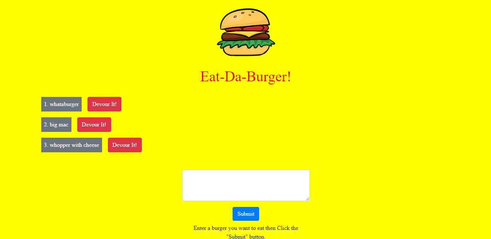
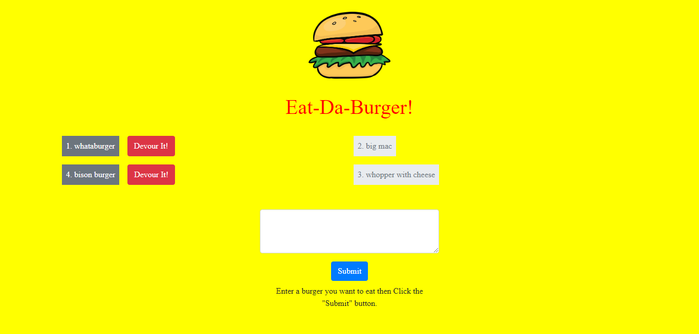

# burger

### Overview
This application uses Node, Express, SQL database, and Express-handlebars to create a website allows the user to create and devour burgers.  The website starts out with examples of types of burgers that can be devoured along with a devour button that they can press which will allow them to devour the burger on the left side of the screen. There is also a textarea that the user can enter in any type of burger of their choosing along with a submit button.  When the user presses the submit button the burger type they just enter along with an associated devoured button is add to the rest of the burgers on the screen.  When the user presses a devour button the burger it is related to, is removed from the list of burgers on the left and is added to a list of devoured burgers on the right.  All the information for the burgers is saved in a local SQL database.  I was the sole creator of this website.

### How the application is organized
* The folder structure for the website is detailed below:
```
burger
├── config
│   ├── connection.js
│   └── orm.js
│ 
├── controllers
│   └── burgers_controller.js
│
├── db
│   ├── schema.sql
│   └── seeds.sql
│
├── models
│   └── burger.js
│ 
├── node_modules
│ 
├── package.json
│
├── public
│   └── assets
│       ├── css
│       │   └── burger_style.css
|       ├── img
│       │   └── burger.png
│       └── js
│           └── burgers.js      
│   
│
├── server.js
│
└── views
    ├── index.handlebars
    └── layouts
        └── main.handlebars 
```

This application uses a server.js javascript files that creates a server using express.  The config folder holds 2 javascript files, one of which makes a connection to database and one which querys the database to perform CRUD commands on the database.  The controllers folder holds a javascript file that contains the routers for the server.  The db file holds the schema and seed files for creating the associated database.  The models folder holds a javascript file that links the server to the database.  The views folder holds all of the handlebars html for creating the front-end of the website.  Finally the public folder has the images and CSS for the front-end of the website.  It also has the javascript responsible for sending information from the front-end to the server.


### Technologies used in the application
1.  Javascript
2.  Node
3.  Express NPM
4.  HTML
5.  mysql NPM, and SQL database
6.  Express-handlebars NPM
7.  CSS/Bootstrap

### Using the application
To use the application please go the deployed website below at Heroku.

  [Heroku Link](https://cryptic-caverns-04713.herokuapp.com/)

When you first git on the website it will take you to the home page.  Screenshot is shown below.


  

You will see a text box in which the user can input in anytype of burger they wish.  Below the text box is submit button.  Once the user enters a burger and hits the submit button the newly entered burger appears on the left side of the screen along with an associated devour button as seen below.

  

If the user decides to hit a devour button then the devour button along with its associated burger is removed from the left side of the screen and appears on the right as the burger has now been devoured.

  

### Links associated with the application
1.  Link to git hub repository for this app:  [Github Link](https://github.com/eozuna3/burger)
2.  Link to deployed heroku website:  [Heroku Link](https://cryptic-caverns-04713.herokuapp.com/)